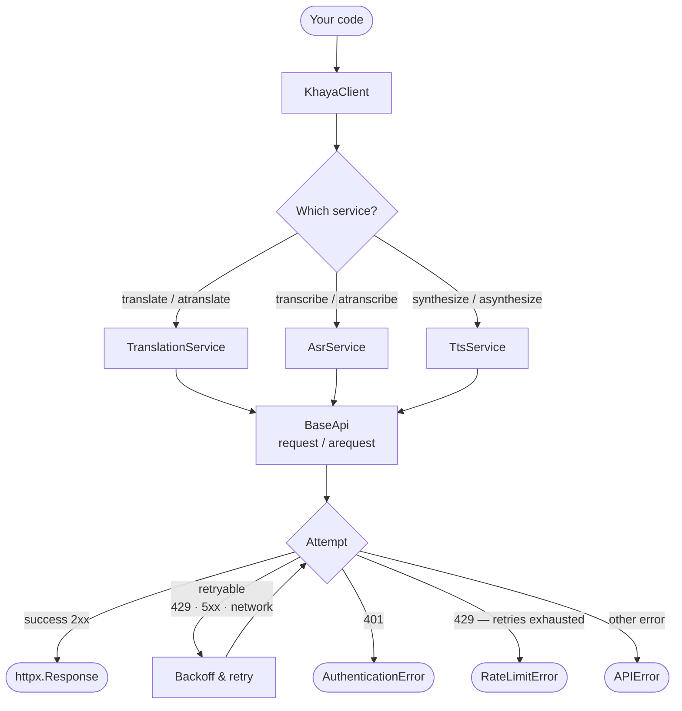
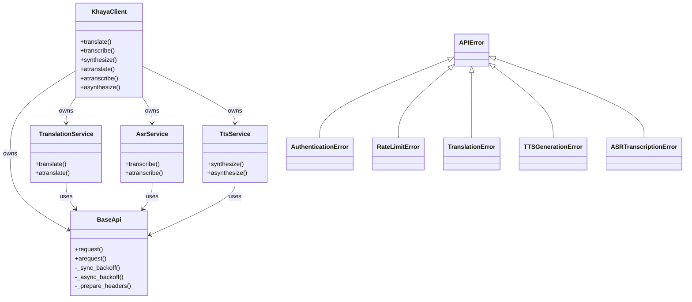

# How it works

This page is for contributors and advanced users who want to understand the SDK's internals.

## Request flow

Every API call follows the same path through three layers:



## Layers

### KhayaClient

The public entry point. Holds one instance of each service and delegates every method call to the appropriate service. Also owns the context manager lifecycle — closing the underlying HTTP clients on exit.

### Service layer

`TranslationService`, `AsrService`, and `TtsService` each handle one concern:

- **Input validation** — raises a service-specific exception (`TranslationError`, etc.) before any HTTP call is made
- **Language validation** — emits a `UserWarning` for unknown language codes, but still sends the request
- **Payload construction** — builds the correct JSON body or multipart form for the endpoint
- **Authentication guard** — the `@check_authentication` decorator raises `AuthenticationError` immediately if no API key is configured

### BaseApi

The HTTP transport layer. Owns the `httpx.Client` (sync) and `httpx.AsyncClient` (async) instances and implements:

- **Retry loop** — up to `config.retry_attempts` attempts on retryable status codes (429, 500, 502, 503, 504) and transport errors
- **Backoff** — exponential backoff with jitter: `delay = 2^attempt + random(0, 1)` seconds; respects `Retry-After` header on 429 responses
- **Exception mapping** — converts HTTP error responses to the appropriate `APIError` subclass
- **Logging** — emits `DEBUG` on every attempt and successful response; `WARNING` on retries and transport errors

## Class structure



## Logger hierarchy

All loggers use `logging.getLogger(__name__)`, giving a clean namespace under `khaya`:

```
khaya                          ← NullHandler (silent by default)
├── khaya.services.base_api    ← HTTP attempts, retries, backoff, responses
├── khaya.services.translation ← char count, language pair
├── khaya.services.asr         ← language, audio file size
└── khaya.services.tts         ← char count, language, audio output size
```

See the [Logging guide](guides/logging.md) for how to enable and configure SDK logs.

## Exception mapping

| HTTP status | Exception raised |
|-------------|-----------------|
| 401 | `AuthenticationError` |
| 429 (retries exhausted) | `RateLimitError` |
| 500, 502, 503, 504 (retries exhausted) | `APIError` |
| Network / transport failure (retries exhausted) | `APIError` (status_code=0) |
| Empty text / missing file (before HTTP) | Service-specific exception |
| Missing API key (before HTTP) | `AuthenticationError` |
