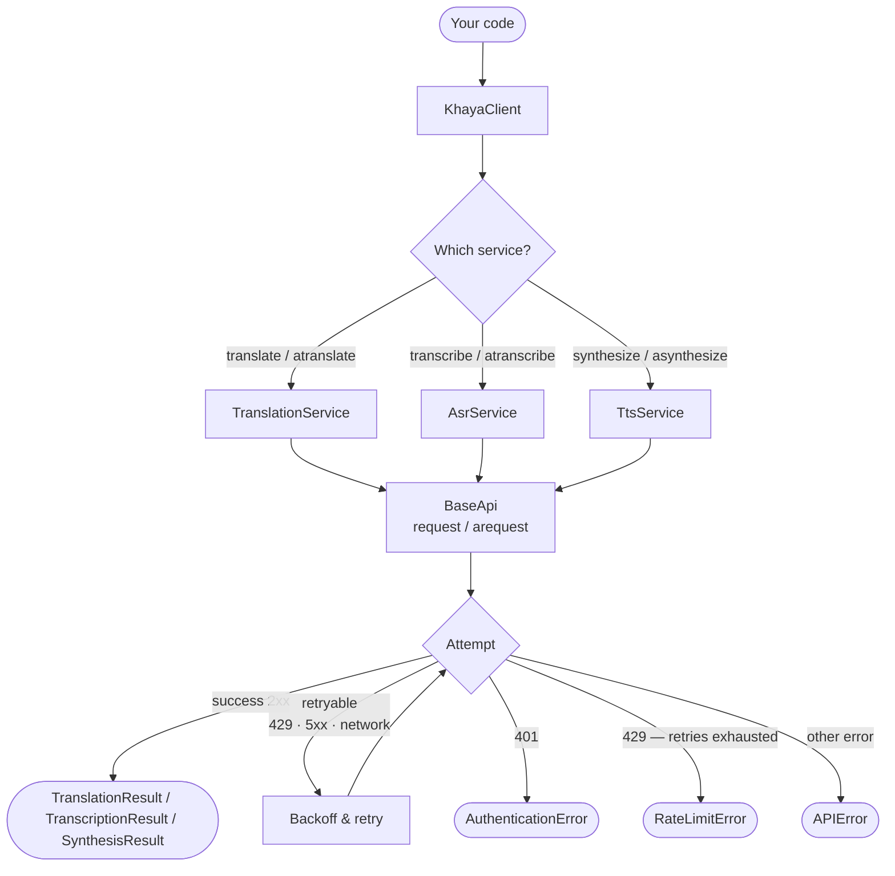
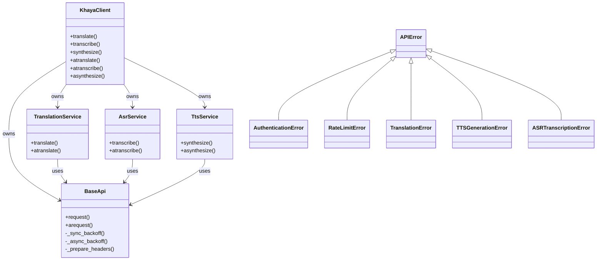

# How it works

This page is for contributors and advanced users who want to understand the SDK's internals.

## Request flow

Every API call follows the same path through three layers:


```mermaid
flowchart TD
    A([Your code]) --> B[KhayaClient]
    B --> C{Which service?}
    C -->|translate / atranslate| D[TranslationService]
    C -->|transcribe / atranscribe| E[AsrService]
    C -->|synthesize / asynthesize| F[TtsService]
    D & E & F --> G[BaseApi\nrequest / arequest]
    G --> H{Attempt}
    H -->|success 2xx| I([TranslationResult / TranscriptionResult / SynthesisResult])
    H -->|retryable\n429 · 5xx · network| J[Backoff & retry]
    J --> H
    H -->|401| K([AuthenticationError])
    H -->|429 — retries exhausted| L([RateLimitError])
    H -->|other error| M([APIError])
```

## Layers

### KhayaClient

The public entry point. Holds one instance of each service and delegates every method call to the appropriate service. Also owns the context manager lifecycle — closing the underlying HTTP clients on exit.

### Service layer

`TranslationService`, `AsrService`, and `TtsService` each handle one concern:

- **Input validation** — raises a service-specific exception (`TranslationError`, etc.) before any HTTP call is made
- **No language validation** — language codes are passed through untouched. The API accepts multiple spellings per language and adds languages independently of SDK releases, so client-side checking produced false rejections of valid calls. The API is the authority; unsupported codes come back as an `APIError` with a `VALIDATION_FAILED` code.
- **Payload construction** — a JSON body for translation and TTS; ASR posts the raw audio bytes with the language as a query parameter
- **Response validation** — TTS checks the body is audio (content-type or `RIFF` magic) before returning it, and rejects an unknown `speaker` before sending. Translation and ASR decode JSON, raising `APIError` on a non-JSON 2xx
- **Authentication guard** — the `@check_authentication` decorator raises `AuthenticationError` immediately if no API key is configured

### BaseApi

The HTTP transport layer. Owns the `httpx.Client` (sync) and `httpx.AsyncClient` (async) instances and implements:

- **Retry loop** — up to `config.retry_attempts` attempts on retryable status codes (429, 500, 502, 503, 504) and transport errors
- **Backoff** — exponential backoff with jitter: `delay = 2^attempt + random(0, 1)` seconds, capped at 60s; a `Retry-After` header takes precedence and is capped the same way
- **Exception mapping** — converts HTTP error responses to the appropriate `APIError` subclass
- **Logging** — emits `DEBUG` on every attempt and successful response; `WARNING` on retries and transport errors

## Class structure


```mermaid
classDiagram
    class KhayaClient {
        +translate()
        +transcribe()
        +synthesize()
        +atranslate()
        +atranscribe()
        +asynthesize()
    }

    class BaseApi {
        +request()
        +arequest()
        -_sync_backoff()
        -_async_backoff()
        -_prepare_headers()
    }

    class TranslationService {
        +translate()
        +atranslate()
    }

    class AsrService {
        +transcribe()
        +atranscribe()
    }

    class TtsService {
        +synthesize()
        +asynthesize()
    }

    class APIError
    class AuthenticationError
    class RateLimitError
    class TranslationError
    class TTSGenerationError
    class ASRTranscriptionError

    KhayaClient --> BaseApi : owns
    KhayaClient --> TranslationService : owns
    KhayaClient --> AsrService : owns
    KhayaClient --> TtsService : owns
    TranslationService --> BaseApi : uses
    AsrService --> BaseApi : uses
    TtsService --> BaseApi : uses

    APIError <|-- AuthenticationError
    APIError <|-- RateLimitError
    APIError <|-- TranslationError
    APIError <|-- TTSGenerationError
    APIError <|-- ASRTranscriptionError
```

## Logger hierarchy

All loggers use `logging.getLogger(__name__)`, giving a clean namespace under `khaya`:

```
khaya                          ← NullHandler (silent by default)
├── khaya.services.base_api    ← HTTP attempts, retries, backoff, responses
├── khaya.services.translation ← char count, language pair
├── khaya.services.asr         ← language, audio file size
└── khaya.services.tts         ← char count, language, audio output size
```

See the [Logging guide](guides/logging.md) for how to enable and configure SDK logs.

## Exception mapping

| HTTP status | Exception raised |
|-------------|-----------------|
| 401 | `AuthenticationError` |
| 429 (retries exhausted) | `RateLimitError` |
| 500, 502, 503, 504 (retries exhausted) | `APIError` |
| Network / transport failure (retries exhausted) | `APIError` (status_code=0) |
| 200 with a non-audio body (TTS) | `TTSGenerationError` |
| 200 with a non-JSON body (translation, ASR) | `APIError` |
| Empty text / missing file / unknown speaker (before HTTP) | Service-specific exception |
| Missing API key (before HTTP) | `AuthenticationError` |

## API versions

The Khaya API versions each service independently. The SDK currently calls v1
of all three:

| Service | SDK calls | Also available |
|---------|-----------|----------------|
| Translation | `/v1/translate` | `/v2/translate` — same response shape |
| ASR | `/asr/v3/transcribe` | `/asr/v1/`, `/asr/v2/` — v1 returns a bare string with no warnings or timings |
| TTS | `/tts/v1/tts` | `/tts/v2/synthesize` |

ASR moved to v3 because it is the only version change that earns itself:
same latency as v1 (measured at 0.65s on a 1.2s clip and 3.1s on a 22.8s
clip), but a structured body carrying `warnings` and optional word/segment
timings. Translation v2 and TTS v2 are identical to v1 in shape, latency and
output, so the SDK stays on v1 for those. Set `Settings.asr_version` to pin
an older version.

TTS has no v3, and translation has no v3 — v2 is the ceiling for both.

Only `/asr/v1/languages` has no catalogue endpoint; `SUPPORTED_ASR_LANGUAGES`
is therefore generated from `/asr/v3/languages`, whose codes v1 also accepts.
